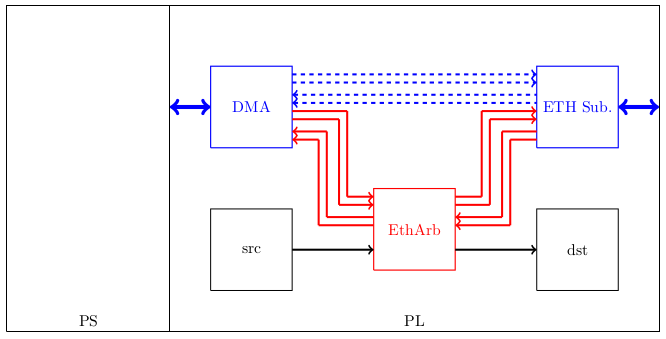
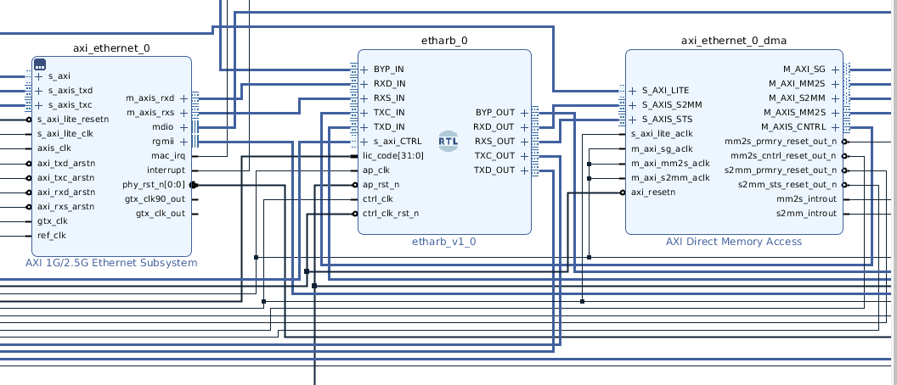
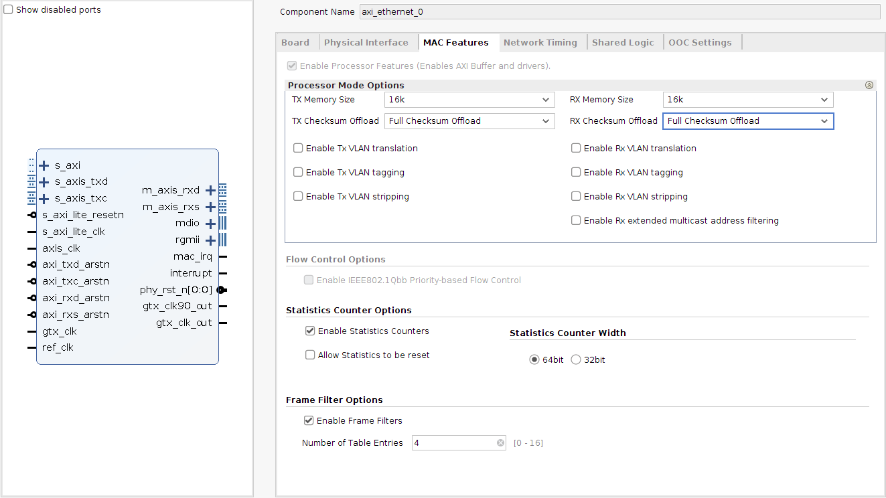

# ETHARB_TX
## A UDP arbiter for SoC with PL-connected 1G PHY
#### move data off of the PL-side without a DMA IP
- note the RX side is not implemented yet

## --- as demonstrated using the Ethernet FMC project and Xilinx ZC706 --- 
#### _please see_ https://ethernetfmc.com/ & https://github.com/fpgadeveloper/ethernet-fmc-axi-eth
The Ethernet FMC board has four PHY (this project only uses one) and can be used with a Zynq to connect to the PL-side of the Soc via the GEM (PS) through GMII to RGMII or via a DMA and Ethernet Subsystem IP.

In many instances, one simply wishes to collect data and get it off the SoC to a host as quickly as possible.  The typical paradigm is to have some mechanism that requires a DMA IP to get data to PS RAM and then use software to send it out the wire.  With the ethernet PHY attached to the PL-side, there are two advantages that can be taken: 
- No custom DMA kernel code required (PL DMA Ethernet uses existing drivers)
- Processor resources are freed-up (interrupts, eth stack, etc.)

The technique presented here could be used with microblaze and using Linux or bare metal.  Zynq and Linux is used here.

#### IP USES HLS 

I have implemented this process using pure RTL but I thought I should evaluate HLS.  A counter data source IP is also writen using HLS.

#### TO BIULD:

This is as simple as sourcing Vivado and Petalinux, here using 2019.1 and then running the _build_zc706.sh_ shell script.  It will first build the _etharb_tx_ and _eth_tstsrc_ IP.  Please note that this current configuration is designed to use jumbo frames, so the host computer will need to be adjusted.  The scrip goes on to build a vivado project and waits for completion.  It then builds a petalinux project copies in the requisite files (including the patch from ethernet-fmc).  It is simply copy BOOT.BIN and image.ub to a SD card.

- source Vivado and Petalinux
- _./build_zc706.sh_
- copy BOOT.BIN and image.ub from _linux/linux_zc706/build/images/_ to SD card

#### TO TEST:

Please recall this demo uses jumbo frames, the MTU will need to be set

    ifconfig eth0 mtu 9000  #on the host
    
and on the Zynq (user and password "root", ip is 192.168.1.50):

    ifconfig eth0 down
    ifconfig eth0 mtu 9000 up
    
    etharbtxtest
    
_etharbtxtest_ is a C utility that will set the required registers, via a kernel module, to run etharb_tx.  The default UDP data will be sent from the current ip address to 192.168.1.100:8888.  Note that the destination MAC address is broadcast - the 2019.1 petalinux kernel does not have ARP.  Other addresses and ports can be used:

    etharbtxtest -a <address> -p <port> -i
    
The -i switch will bump the source address and MAC up by one (e.g. 192.168.1.50 -> 192.168.1.51 and 00:0A:35:00:22:01 -> 00:0A:35:00:22:02).  There is the remote possibilty that an IPV4 ID field could be used from both devices (PL and etharbt_tx) and if the PS packet was more than the MTU in length, something strange could happen.  It could happen.... but I've not had an issue.  Either way, the -i switch will make the packet look as if it originated from a different source (but the host ARP would be unaware).

On the host side, simply use the _quicktest.py_ script in _python/_ to listen for 10 seconds on port 8888.  This will give you some statistics - I typically get at least 990 MBps, depending on traffic from the PS.

#### NOTES:
This project requires the Ethernet Subsystem be configured with full checksum offload, and I use larger fifos:

Please cite this project if used in research and in production designs, please contact me for my records and feel free to reach out for support!
